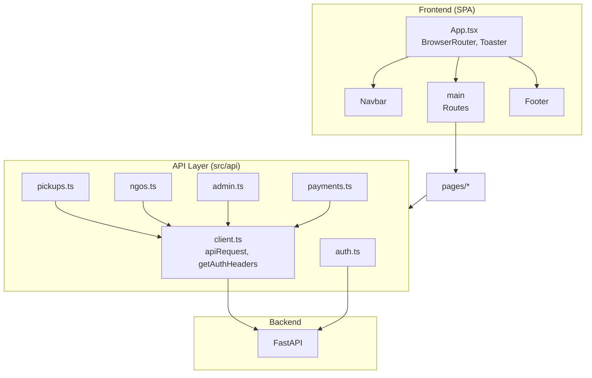
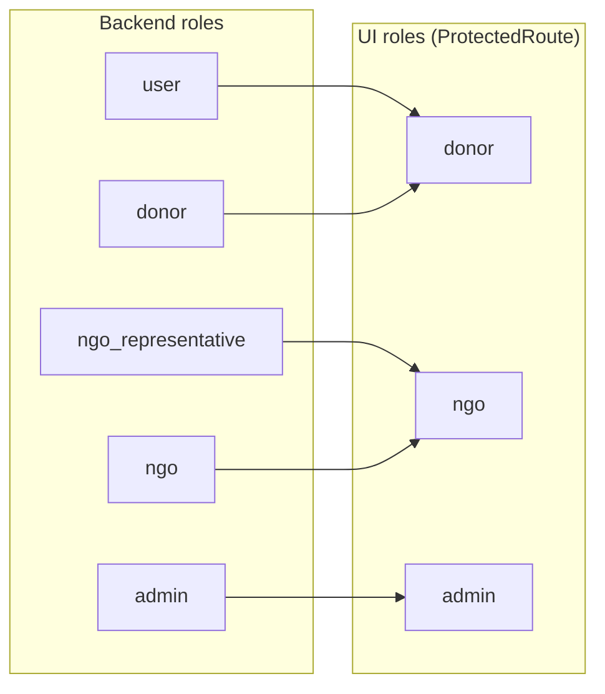

# System Design

Overview of the frontend architecture, folder structure, routing, and high-level design.

## High-Level Architecture



**Data flow (page → API → backend):**

```mermaid
sequenceDiagram
    participant Page as Page Component
    participant API as api/*.ts
    participant Client as client.ts
    participant Backend as FastAPI

    Page->>+API: e.g. listPickups()
    API->>Client: apiRequest(path, options)
    Client->>Client: getAuthHeaders() from localStorage
    Client->>+Backend: fetch(API_BASE + path, Bearer token)
    Backend-->>-Client: JSON
    Client-->>-API: parsed data
    API-->>-Page: data or throw
```

## Tech Stack

| Layer | Technology |
|-------|------------|
| Runtime | React 18 |
| Build | Vite 5 |
| Language | TypeScript |
| Routing | React Router v6 |
| Styling | Tailwind CSS |
| UI Primitives | Radix UI (Label, Popover), custom components |
| Icons | Lucide React |
| Toasts | Sonner |

## Folder Structure

```
frontend/
├── public/                 # Static assets
├── src/
│   ├── api/                # API client and endpoint modules
│   │   ├── client.ts       # Shared fetch + auth headers
│   │   ├── auth.ts         # User/NGO auth, signup, login, verify
│   │   ├── pickups.ts      # Pickup CRUD and status
│   │   ├── ngos.ts         # NGO list and profile
│   │   ├── admin.ts        # Admin dashboard and management
│   │   └── payments.ts     # Payment confirmation
│   ├── components/         # Reusable UI
│   │   ├── ui/             # Base UI (Button, Card, Input, Label)
│   │   ├── Navbar.tsx, Footer.tsx, Logo.tsx
│   │   ├── ProtectedRoute.tsx, UserProfileDropdown.tsx
│   │   ├── GeoapifyAddressInput.tsx, LocationInput.tsx
│   │   └── ...
│   ├── hooks/
│   │   └── useAuth.ts      # Auth state + logout + redirect
│   ├── lib/
│   │   └── utils.ts        # cn() for class names
│   ├── pages/              # Route-level components
│   ├── App.tsx             # Router, layout, Toaster
│   ├── main.tsx            # React root
│   └── index.css           # Tailwind + CSS variables
├── doc/                    # Documentation
├── package.json
├── vite.config.ts          # @ alias → src
└── .env / .env.example     # VITE_API_BASE_URL
```

## Application Layout

- **Shell**: `App.tsx` wraps the app in `BrowserRouter`, renders `Navbar`, `main`, `Footer`, and `BackToTop`.
- **Toaster**: Sonner `Toaster` is mounted in `App` (e.g. `position="top-right"`) for success/error messages.
- **Conditional shell**: Navbar and Footer are hidden on dashboard/admin routes (`/dashboard/*`, `/admin/*`).

## Routing

```mermaid
flowchart LR
    subgraph Public["Public Routes"]
        Home[/]
        About[/about]
        NGOs[/ngos]
        Contact[/contact]
        Login[/login]
        Register[/register]
        Verify[/verify]
    end
    subgraph Donor["Donor (protected)"]
        DashD[/dashboard/donor]
        Pickups[/dashboard/donor/pickups]
        NewP[/dashboard/donor/pickups/new]
    end
    subgraph NGO["NGO (protected)"]
        DashN[/dashboard/ngo]
        NgoP[/dashboard/ngo/pickups]
    end
    subgraph Admin["Admin (protected)"]
        AdminR[/admin/*]
    end
    Login --> DashD
    Login --> DashN
    Login --> AdminR
```

| Path | Access | Component |
|------|--------|-----------|
| `/` | Public | Home |
| `/about`, `/ngos`, `/contact`, `/terms`, `/privacy` | Public | About, NGOs, Contact, Terms, Privacy |
| `/login`, `/register`, `/register/ngo`, `/verify` | Public | Login, Register, RegisterNGO, Verify |
| `/donate`, `/feedback` | Public | Donate, Feedback |
| `/dashboard/user` | — | Redirects to `/dashboard/donor` |
| `/dashboard/donor` | Donor | DonorDashboard |
| `/dashboard/donor/pickups`, `.../pickups/new`, `.../pickups/:id` | Donor | DonorDashboard (tabs) / NewPickup / PickupDetail |
| `/dashboard/admin` | — | Redirects to `/admin` |
| `/admin/*` | Admin | AdminDashboard |
| `/dashboard/ngo` | NGO | NGODashboard |
| `/dashboard/ngo/pickups`, `.../pickups/:id` | NGO | NgoPickups, NgoPickupDetailPage |

## Role Model



- **donor** (and **user**): Donate items; use donor dashboard and pickup flows.
- **ngo** (and **ngo_representative**): Receive donations; use NGO dashboard and pickup management.
- **admin**: Full admin dashboard (users, NGOs, pickups, config).

`ProtectedRoute` and `useAuth` map backend roles to these three (donor, ngo, admin) and redirect unauthenticated or wrong-role users.

## State and Data Flow

- **Auth state**: Stored in `localStorage` (`access_token`, `user`, etc.). No global auth context; helpers in `api/auth.ts` and `hooks/useAuth.ts` read/write it.
- **API calls**: Pages and components call functions in `api/*.ts`; authenticated requests use `getAuthHeaders()` from `api/client.ts`.
- **Server state**: No React Query/SWR; pages use local `useState`/`useEffect` and refetch as needed.

## Key Design Decisions

1. **Single backend base URL**: Configured via `VITE_API_BASE_URL`; all API modules use it (see [Environment](06-environment.md) and [API calls](02-api-calls.md)).
2. **Role-based routing**: `ProtectedRoute` enforces role; redirect to `/login` if not authenticated, to `/` if role does not match.
3. **Dashboard vs marketing**: Dashboard and admin areas use a different layout (no Navbar/Footer) for a dedicated app experience.
4. **Component organization**: Route-level views in `pages/`, shared UI in `components/`, API and auth in `api/` and `hooks/`.

For authentication details, see [Authentication](07-authentication.md). For API usage, see [API calls](02-api-calls.md).
