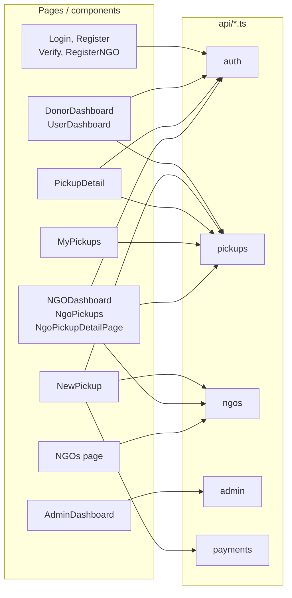

# API Calls

Documentation of all backend API usage from the frontend: modules, endpoints, and usage.

## Which pages use which API modules

**Shared:** All authenticated requests go through `client.ts` (getAuthHeaders, apiRequest).

## Base Configuration

- **Base URL**: `import.meta.env.VITE_API_BASE_URL` or `http://localhost:8000` (see [Environment](06-environment.md)).
- **Auth**: Authenticated requests send `Authorization: Bearer <access_token>`; token is read from `localStorage` via `api/client.ts` → `getAuthHeaders()`.

## API Client (`src/api/client.ts`)

- **`getAuthHeaders()`**: Returns `{ 'Content-Type': 'application/json', Authorization?: 'Bearer ...' }`.
- **`apiRequest<T>(path, options)`**: `fetch(API_BASE + path)` with auth headers, JSON body where applicable. On non-OK response, parses `detail` (string or array of `{ msg }`) and throws `Error`. On network failure, throws a user-friendly message.

All modules below that use "apiRequest" rely on this client.

---

## Auth (`src/api/auth.ts`)

Uses raw `fetch` to the same base URL (no `apiRequest` for login/signup so no auth header).

| Function | Method | Endpoint | Auth | Description |
|----------|--------|----------|------|-------------|
| `signup(data)` | POST | `/user/signup` | No | Register donor/user |
| `login(credentials)` | POST | `/user/login` | No | Donor login; returns `access_token`, `user` |
| `verifyEmail(token)` | GET | `/verify?token=...` | No | Email verification (donor/NGO) |
| `logout()` | POST | `/auth/logout` | Bearer | Logout |
| `changePassword(current, new)` | POST | `/user/change-password` | Bearer | Change password |
| `fetchUserProfile()` | GET | `/user/me` | Bearer | Current user profile |
| `ngoRegister(data)` | POST | `/ngo/register` | No | Register NGO |
| `ngoLogin(credentials)` | POST | `/ngo/login` | No | NGO login |

**Helpers (no HTTP):** `getCurrentUser()`, `getAuthToken()`, `isAuthenticated()`, `getUserRole()`, `clearAuthData()` — all read/clear `localStorage`.

---

## Pickups (`src/api/pickups.ts`)

Uses `apiRequest` (auth attached by client).

| Function | Method | Endpoint | Description |
|----------|--------|----------|-------------|
| `createPickup(body)` | POST | `/pickups` | Create pickup; returns `pickup` + `payment` (Razorpay order) |
| `listPickups(status?)` | GET | `/pickups` or `/pickups?status=...` | List pickups for current user |
| `getPickup(pickupId)` | GET | `/pickups/:pickupId` | Pickup detail + status history |
| `updatePickupStatus(pickupId, status, note?)` | PATCH | `/pickups/:pickupId/status` | Update status (e.g. NGO flow) |

**Types:** `PickupStatus`, `PickupCreateBody`, `PickupListItem`, `PickupDetail`, `StatusHistoryEntry`, `CreatePickupResponse`.

---

## NGOs (`src/api/ngos.ts`)

| Function | Method | Endpoint | Auth | Description |
|----------|--------|----------|------|-------------|
| `listVerifiedNGOs()` | GET | `/ngo/list` | No | Raw `fetch`; list of verified NGOs for donor dropdown |
| `getNGOProfile()` | GET | `/ngo/me` | Bearer | apiRequest; current NGO profile |

**Types:** `NGOOption`, `NGOProfile`, `NGOType`.

---

## Payments (`src/api/payments.ts`)

Uses `apiRequest`.

| Function | Method | Endpoint | Description |
|----------|--------|----------|-------------|
| `confirmPayment(body)` | POST | `/payments/confirm` | Confirm Razorpay payment (order_id, payment_id, signature) |
| `getPaymentForPickup(pickupId)` | GET | `/payments/pickup/:pickupId` | Payment status for a pickup |

---

## Admin (`src/api/admin.ts`)

All use `apiRequest` with admin auth.

| Function | Method | Endpoint | Description |
|----------|--------|----------|-------------|
| `getAdminDashboard()` | GET | `/admin/dashboard` | Stats (users, NGOs, pickups, deposits) |
| `getAdminUsers(params?)` | GET | `/admin/users?role=&search=&is_active=` | List users |
| `updateAdminUser(userId, body)` | PATCH | `/admin/users/:userId` | Update role / is_active |
| `getAdminNGOs(is_verified?)` | GET | `/admin/ngos` or `?is_verified=` | List NGOs |
| `updateAdminNGO(ngoId, body)` | PATCH | `/admin/ngos/:ngoId` | e.g. verify NGO |
| `deleteAdminNGO(ngoId)` | DELETE | `/admin/ngos/:ngoId` | Delete NGO |
| `getAdminPickups(status?)` | GET | `/admin/pickups` or `?status=` | List pickups |
| `getAdminPickup(pickupId)` | GET | `/admin/pickups/:pickupId` | Pickup detail |
| `getAdminConfig()` | GET | `/admin/config` | e.g. deposit_amount_paise |
| `updateAdminConfig(body)` | PUT | `/admin/config` | Update config |

---

## Error Handling

- **apiRequest**: Non-OK responses → JSON `detail` parsed to string message → `throw new Error(msg)`.
- **auth.ts**: Custom `parseDetail()` for signup/login/verify/NGO to normalize string/array/object `detail`.
- **Network errors**: `client.ts` maps fetch failures to a generic "Network error" message.

Pages typically catch these errors and show them via Sonner (`toast.error(...)`).

For backend contract and environment variables, see [Environment](06-environment.md) and [Integration](03-integration.md).
