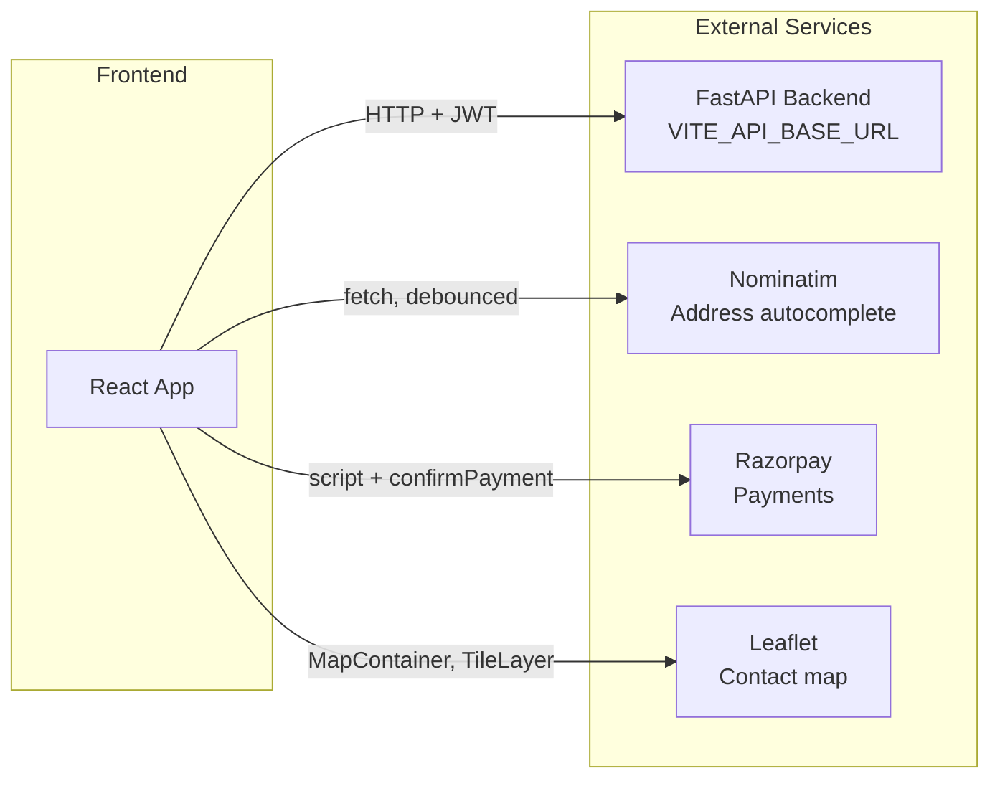

# Integration

How the frontend integrates with the backend, third-party APIs, and external services.

## Integration Overview

**Toast notifications** (Sonner) are in-app only; no external service.

## Backend (FastAPI)

- **Base URL**: Set in `.env` as `VITE_API_BASE_URL` (default `http://localhost:8000`). Used by `api/client.ts` and all API modules.
- **Auth**: JWT in `Authorization: Bearer <access_token>`. Token and user payload are stored in `localStorage` after login; logout calls backend `/auth/logout` and then clears local storage.
- **CORS**: Backend must allow the frontend origin (e.g. `http://localhost:5173` in dev) for browser requests to succeed.

See [API calls](02-api-calls.md) and [Authentication](07-authentication.md) for endpoint and flow details.

## Address Search (Nominatim / OpenStreetMap)

- **Component**: `GeoapifyAddressInput` (and optionally `LocationInput`).
- **Service**: Nominatim API — `https://nominatim.openstreetmap.org/search`.
- **Usage**: Address autocomplete; user types → debounced request → display suggestions; on select, address is parsed into street, city, state, pincode for forms (e.g. donor registration, NGO registration).
- **Headers**: `User-Agent` is set (e.g. `OpenHandsDonation/1.0`) to comply with Nominatim usage policy.
- **No API key**: Nominatim is used without a key; rate limits apply.

## Maps (Leaflet / React-Leaflet)

- **Where**: Contact page (`Contact.tsx`) shows a map with a marker.
- **Libraries**: `leaflet`, `react-leaflet`, `@types/leaflet`.
- **Assets**: Default marker icons loaded from CDN (marker-icon, marker-icon-2x, marker-shadow) to fix React/Leaflet default icon path issues.
- **CSS**: `leaflet/dist/leaflet.css` is imported in the page that renders the map.

## Payments (Razorpay)

- **Flow**: Donor creates a pickup → backend returns Razorpay order details (`order_id`, `amount`, `key_id`, etc.) → frontend loads Razorpay script and opens checkout → on success, frontend calls `confirmPayment()` with `razorpay_order_id`, `razorpay_payment_id`, `razorpay_signature` to backend `/payments/confirm`.
- **Module**: `api/payments.ts` — `confirmPayment`, `getPaymentForPickup`. Razorpay script is loaded in the page that performs payment (e.g. NewPickup).

## Toasts (Sonner)

- **Library**: `sonner`.
- **Setup**: `<Toaster position="top-right" richColors closeButton />` in `App.tsx`.
- **Usage**: Pages call `toast.success(...)` or `toast.error(...)` for user feedback (e.g. login failure, registration success, API errors).

## Build and Path Alias

- **Vite**: `vite.config.ts` sets `resolve.alias`: `@` → `./src`. Imports use `@/api/...`, `@/components/...`, `@/lib/...`, etc.
- **Env**: Only `VITE_*` variables are exposed to the client; use `import.meta.env.VITE_API_BASE_URL` for the API base.

For env vars and deployment, see [Environment](06-environment.md).
