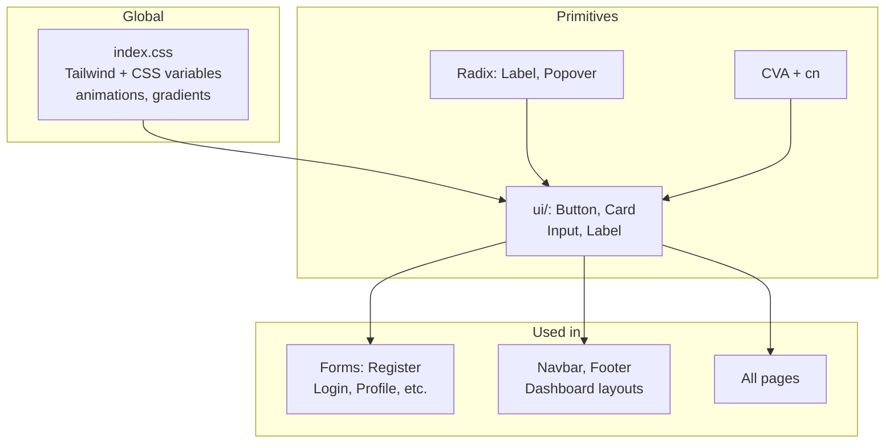

# UI Library & Styling

Overview of the UI stack: Tailwind, Radix, custom components, and utilities.

## How UI pieces fit together

**Design tokens:** `index.css` defines `--primary`, `--background`, etc. → Tailwind utilities (`bg-primary`) → components use `cn()` to merge classes.

## Tailwind CSS

- **Version**: 3.x (see `package.json`).
- **Config**: Standard Tailwind; PostCSS and Autoprefixer are used (no custom config path shown in repo; defaults apply).
- **Entry**: `src/index.css` imports `@tailwind base;`, `@tailwind components;`, `@tailwind utilities;`.

### CSS Variables (Design Tokens)

`index.css` defines a **light** and **.dark** palette using HSL CSS variables:

| Variable | Purpose |
|----------|---------|
| `--background`, `--foreground` | Page background and text |
| `--card`, `--card-foreground` | Card surface and text |
| `--primary`, `--primary-foreground` | Primary actions and text on primary |
| `--secondary`, `--secondary-foreground` | Secondary surfaces |
| `--muted`, `--muted-foreground` | Muted backgrounds and text |
| `--accent`, `--accent-foreground` | Hover/active states |
| `--destructive`, `--destructive-foreground` | Destructive actions |
| `--border`, `--input`, `--ring` | Borders, inputs, focus ring |
| `--radius` | Default border radius (e.g. 0.5rem) |

Usage in Tailwind: e.g. `bg-background`, `text-foreground`, `bg-primary`, `border-input`, `rounded-[var(--radius)]`.

### Custom Classes and Animations

- **Animations**: `@keyframes fade-up` and `.animate-fade-up` for fade + slide-up.
- **Nav link**: `.nav-link` and `.nav-link::after` for underline-on-hover.
- **Gradients**: `.hero-gradient`, `.footer-gradient` for purple/blue gradients.

### Typography

- **Body font**: `font-family: 'Inter', sans-serif` applied to `body` in `@layer base`.

---

## Radix UI

Used for accessible primitives:

| Package | Usage |
|---------|--------|
| `@radix-ui/react-label` | `Label` in `src/components/ui/label.tsx` — accessible form labels. |
| `@radix-ui/react-popover` | Available for popovers (e.g. dropdowns, date pickers). |

Other Radix components can be added similarly under `components/ui/`.

---

## Class Variance Authority (CVA)

- **Package**: `class-variance-authority`.
- **Usage**: Define variant-based class sets (e.g. button variants/sizes, label variants). Used in `button.tsx` and `label.tsx` with `cva()` and `VariantProps<typeof ...>`.

---

## Tailwind Merge & clsx

- **Packages**: `tailwind-merge`, `clsx`.
- **Utility**: `src/lib/utils.ts` exports `cn(...inputs)` implemented as `twMerge(clsx(inputs))`.
- **Purpose**: Merge Tailwind classes without conflicts and combine conditional classes (e.g. `cn('base', className)` in components).

---

## Custom UI Components (`src/components/ui/`)

Shared building blocks; all use `cn()` for class merging and support `className` where relevant.

| Component | File | Description |
|-----------|------|-------------|
| **Button** | `button.tsx` | CVA variants: `default`, `destructive`, `outline`, `secondary`, `ghost`, `link`. Sizes: `default`, `sm`, `lg`, `icon`. Forwards ref and native button props. |
| **Card** | `card.tsx` | Card container plus: CardHeader, CardTitle, CardDescription, CardContent, CardFooter. Semantic layout and spacing. |
| **Input** | `input.tsx` | Styled text input: border, ring, placeholder, disabled styles. Forwards ref and native input props. |
| **Label** | `label.tsx` | Radix Label + CVA; used with form controls (e.g. Input). |

Pattern: These are presentational primitives; they don't call API or hold app state. Forms and pages compose them and wire to `api/*` and state.

---

## Layout and Global Structure

- **App shell**: `App.tsx` — Navbar, main content, Footer, BackToTop; Navbar/Footer hidden on dashboard/admin routes.
- **Dashboard layouts**: Donor dashboard, NGO dashboard, and Admin each have their own layout (sidebar/nav) inside the route component.
- **Responsive**: Tailwind breakpoints (`sm:`, `md:`, `lg:`) are used in components (e.g. Navbar mobile menu).

---

## Theming (Dark Mode)

- **Variables**: `index.css` defines `.dark` overrides for all design tokens.
- **Toggle**: No global dark-mode toggle is implemented in the reviewed code; adding one would typically set a class (e.g. `dark`) on `html` or `body` and rely on these variables.

For icon usage across the app, see [Icons](05-icons.md).
