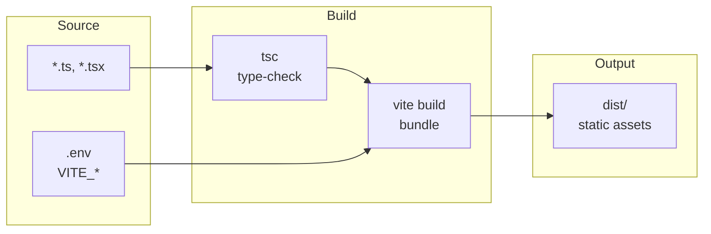

# Environment & Build

Configuration, environment variables, and build setup for the frontend.

## Build pipeline

**At runtime:** Only `VITE_*` from env is available as `import.meta.env.VITE_API_BASE_URL` (used by `api/client.ts` and `api/auth.ts`).

## Environment Variables

The app uses Vite's env system. Only variables prefixed with `VITE_` are exposed to client code.

| Variable | Required | Description |
|----------|----------|-------------|
| `VITE_API_BASE_URL` | No | Backend API base URL. Default: `http://localhost:8000`. |

### Usage in Code

- **API base**: `import.meta.env.VITE_API_BASE_URL || 'http://localhost:8000'` in `api/client.ts` and `api/auth.ts` (and any module that needs the base URL).
- **Example**: In production, set `VITE_API_BASE_URL=https://api.example.com` in the build environment.

### Files

- **`.env`**: Local overrides; not committed (add to `.gitignore` if present).
- **`.env.example`**: Example values for developers; commit this. Example content:
  - `# VITE_API_BASE_URL=http://localhost:8000`

## Build Tool: Vite

- **Config**: `vite.config.ts`.
- **Plugins**: `@vitejs/plugin-react` for React (JSX, fast refresh).
- **Path alias**: `@` → `./src` so imports like `@/api/auth`, `@/components/...` resolve to `src/`.

### Scripts (package.json)

| Script | Command | Purpose |
|--------|---------|---------|
| `dev` | `vite` | Start dev server (e.g. http://localhost:5173). |
| `build` | `tsc && vite build` | Type-check then production build (output in `dist/`). |
| `preview` | `vite preview` | Serve the production build locally. |
| `lint` | `eslint . --ext ts,tsx ...` | Run ESLint on TypeScript/React files. |

## TypeScript

- **Config**: `tsconfig.json` (and/or `tsconfig.node.json` if used). Ensures `@` path alias is recognized for type-checking.
- **Build**: `tsc` runs before `vite build` to fail the build on type errors.

## Deployment Notes

1. Set `VITE_API_BASE_URL` in the build environment to the production API URL.
2. Build: `npm run build`.
3. Serve the `dist/` folder with any static host (e.g. Nginx, Vercel, Netlify). No server-side rendering; SPA only.
4. Ensure the backend allows the frontend origin in CORS (see [Integration](03-integration.md)).
