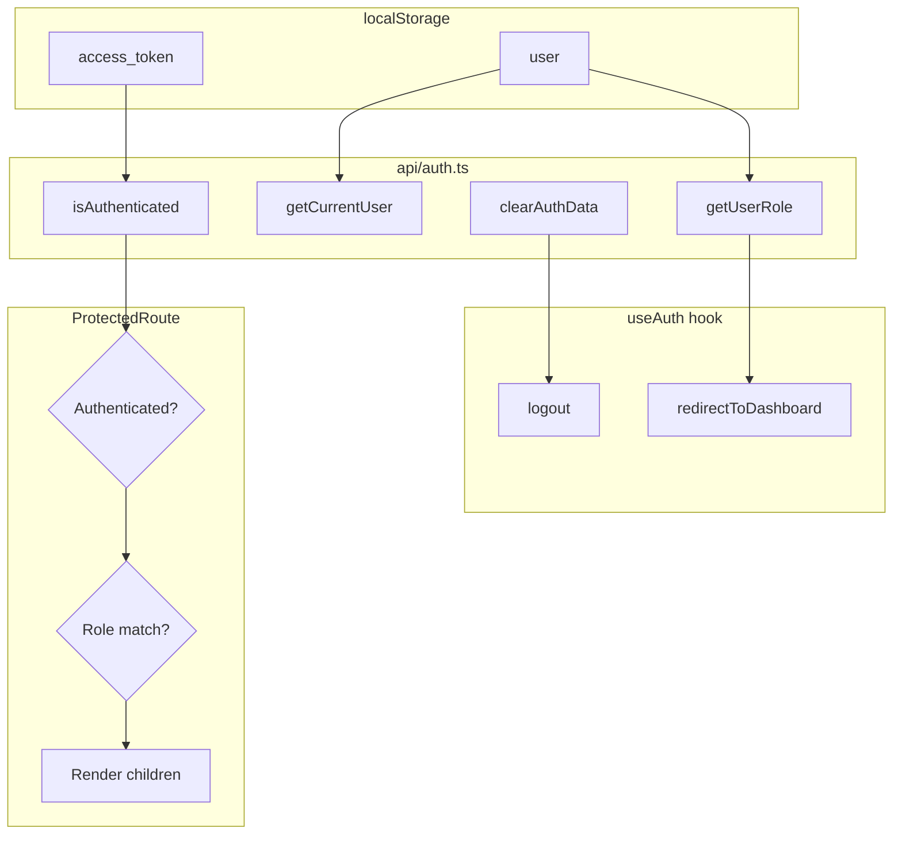
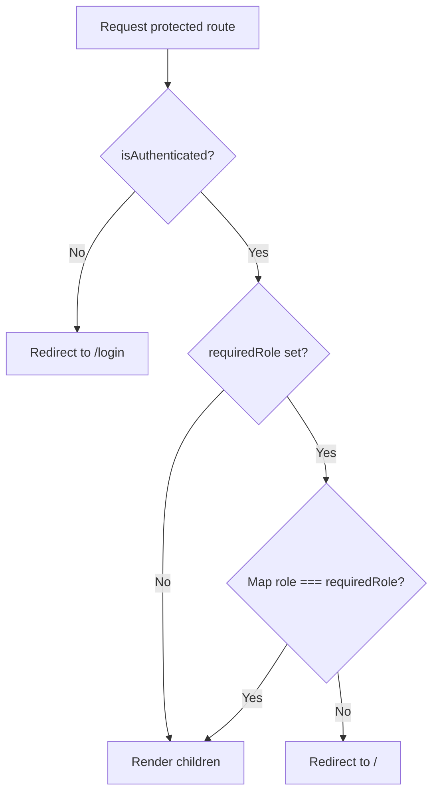
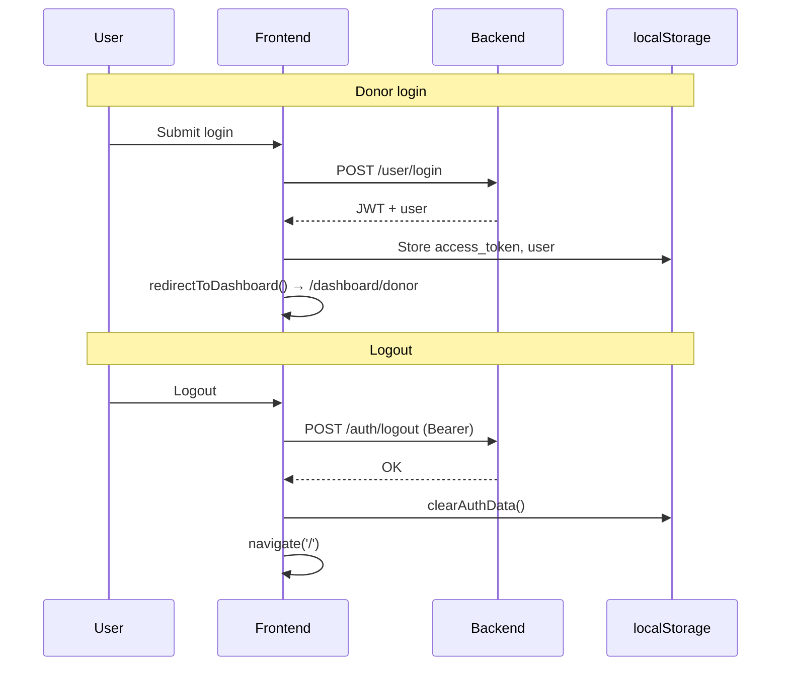

# Authentication

How login, roles, and protected routes work in the frontend.

## Overview

- **Mechanism**: JWT bearer token plus user payload in `localStorage`. No React context for auth; helpers in `api/auth.ts` and `hooks/useAuth.ts` read/write storage and call the backend where needed.
- **Flows**: Donor/user signup and login, NGO registration and login, email verification. Logout calls backend then clears storage.

## Stored Data (localStorage)

After login, the app stores:

| Key | Content |
|-----|--------|
| `access_token` | JWT string |
| `token_type` | Usually `"bearer"` |
| `user` | JSON object with e.g. `user_id`, `email`, `fname`, `lname`, `role` / `user_type` |

**Important**: The frontend does not decode the JWT; it sends it in `Authorization: Bearer <access_token>`. Role and identity for UI come from the `user` object saved at login (and optionally from `/user/me` when a full profile is needed).

## Auth Helpers (`api/auth.ts`)

- **`isAuthenticated()`**: Returns `true` if `access_token` is present.
- **`getCurrentUser()`**: Returns parsed `user` from localStorage or `null`.
- **`getUserRole()`**: Returns `user.role` or `user.user_type` or `null`.
- **`getAuthToken()`**: Returns `access_token` or `null`.
- **`clearAuthData()`**: Removes `access_token`, `token_type`, `user` from localStorage.

After login (donor or NGO), the app should save token and user into localStorage (exact keys as above). Logout calls `/auth/logout` then `clearAuthData()`.

## Role Mapping

Backend roles are mapped to three UI roles:

| Backend role | Mapped role | Redirect after login |
|--------------|-------------|----------------------|
| `user`, `donor` | donor | `/dashboard/donor` |
| `ngo_representative`, `ngo` | ngo | `/dashboard/ngo` |
| `admin` | admin | `/admin` |

This mapping is used in:

- **`ProtectedRoute`**: Required role is one of `donor`, `ngo`, `admin`. Stored role is mapped before comparison; wrong role → redirect to `/`.
- **`useAuth().redirectToDashboard()`**: Uses the same mapping to navigate to the correct dashboard.

## Protected Routes

- **Component**: `ProtectedRoute` in `src/components/ProtectedRoute.tsx`.
- **Behavior**:
  1. If `!isAuthenticated()` → redirect to `/login` (replace).
  2. If `requiredRole` is set → map current role and compare; if not equal → redirect to `/`.
  3. Otherwise render `children`.

Usage in `App.tsx`: wrap dashboard and admin routes, e.g.:

- `<ProtectedRoute requiredRole="donor">` → Donor dashboard and donor pickup routes.
- `<ProtectedRoute requiredRole="ngo">` → NGO dashboard and NGO pickup routes.
- `<ProtectedRoute requiredRole="admin">` → Admin dashboard.

## useAuth Hook (`hooks/useAuth.ts`)

Provides:

- **`user`**: `getCurrentUser()`.
- **`token`**: `getAuthToken()`.
- **`role`**: `getUserRole()`.
- **`isAuthenticated`**: `isAuthenticated()`.
- **`logout()`**: Calls `clearAuthData()` then `navigate('/', { replace: true })`.
- **`redirectToDashboard()`**: Uses role mapping and navigates to `/dashboard/donor`, `/dashboard/ngo`, or `/admin`.

Used in Navbar, dashboard layouts, and anywhere that needs to show user state or perform logout/redirect.

## Flows (Summary)

1. **Donor login**: POST `/user/login` → store token + user → redirect via `redirectToDashboard()` (donor → `/dashboard/donor`).
2. **NGO login**: POST `/ngo/login` → store token + user → redirect to NGO dashboard.
3. **Donor signup**: POST `/user/signup` → show "check email" → user verifies via `/verify?token=...`.
4. **NGO signup**: POST `/ngo/register` → show "pending verification" → admin verifies; NGO can then log in.
5. **Logout**: POST `/auth/logout` (with Bearer token) → `clearAuthData()` → redirect to `/`.

For API endpoints and request/response shapes, see [API calls](02-api-calls.md). For backend and CORS, see [Integration](03-integration.md).
