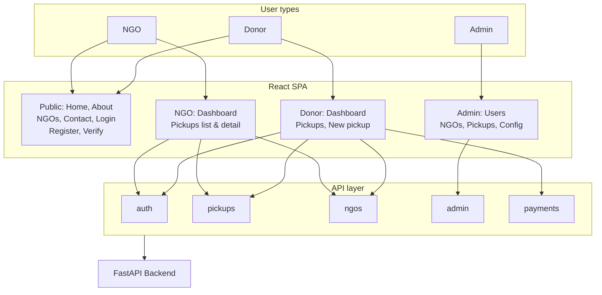

# Presentation Points — Frontend

**Use this as a cheat sheet to explain the frontend in a PPT without opening the code.** Bullet points are ordered for a typical slide flow.

---

## System at a glance

---

## 1. What Does the Frontend Do?

- **OpenHands frontend** — React SPA that lets **donors** donate items (request pickups), **NGOs** manage pickups, and **admins** manage the platform.
- Users see **marketing pages** (Home, About, NGOs, Contact, Donate, Feedback, Terms, Privacy) and **role-specific dashboards** after login.
- All API calls go to the **backend** (FastAPI); auth is **JWT** stored in the browser (localStorage).

---

## 2. Three User Types & Where They Go

| Role | After login | Main screens |
|------|-------------|--------------|
| **Donor** | Donor dashboard | Profile, My pickups, New pickup, Pickup detail |
| **NGO** | NGO dashboard | Profile, Pickups list, Pickup detail (accept, update status) |
| **Admin** | Admin dashboard | Users, NGOs, Pickups, Config (e.g. deposit amount) |

- **Unauthenticated**: Can only access public pages and login/register/verify; protected routes redirect to login or home.

---

## 3. High-Level Architecture (One Slide)

- **Single Page Application (SPA)** — React 18, Vite, TypeScript.
- **Routing**: React Router v6; public routes vs **protected routes** (require login + optional role).
- **State**: No global auth context; **localStorage** holds token and user; API modules and **useAuth** hook read/write it.
- **API layer**: Dedicated modules (auth, pickups, ngos, admin, payments) calling backend with `fetch`; shared **apiRequest** adds auth header and handles errors.
- **UI**: Tailwind CSS, Radix primitives (Label, Popover), custom components (Button, Card, Input, Label), **Lucide** icons, **Sonner** toasts.

---

## 4. Main User Flows (No Code)

**Donor**

1. Register → verify email via link → login.
2. From dashboard: create pickup (choose NGO, address, optional time/description) → pay deposit (Razorpay) → confirm payment.
3. View list of pickups and status; open pickup detail to see history.

**NGO**

1. Register → verify email → wait for admin approval → login.
2. See list of pickups; open a pickup → accept / update status (on the way, picked up, completed).
3. Profile and logout in sidebar/header.

**Admin**

1. Login → land on admin dashboard (stats: users, NGOs, pickups, deposits).
2. Manage users (search, filter, block, change role).
3. Manage NGOs (approve, reject, delete).
4. View pickups; adjust config (e.g. deposit amount).

**Common**

- Address input on forms uses **address autocomplete** (Nominatim/OpenStreetMap).
- **Contact** page has a **map** (Leaflet) and contact form.
- Success/error messages shown as **toasts** (top-right).

---

## 5. Key Pages & Routes (Slide-Friendly List)

- **Public**: Home, About, NGOs, Contact, Login, Register, Register NGO, Verify, Donate, Feedback, Terms, Privacy.
- **Donor**: Dashboard (profile, pickups, new pickup), Pickup detail.
- **NGO**: Dashboard, Pickups list, Pickup detail.
- **Admin**: Admin dashboard (tabs/sections for users, NGOs, pickups, config).
- **Redirects**: `/dashboard/user` → donor dashboard; `/dashboard/admin` → `/admin`.

---

## 6. How Auth Works (Talking Points)

- **Login**: POST to backend → receive JWT and user payload → store in **localStorage** (access_token, user).
- **Protected routes**: Component checks **isAuthenticated()**; if not → redirect to login. If **requiredRole** (donor/ngo/admin) → map backend role and compare; wrong role → redirect to home.
- **Logout**: Call backend logout endpoint then **clear** token and user from localStorage; redirect to home.
- **Role mapping**: Backend may send `user`, `donor`, `ngo_representative`, `ngo`, `admin`; frontend maps these to three UI roles: donor, ngo, admin.

---

## 7. Integrations (One Line Each)

- **Backend API**: All data and auth; base URL from env (`VITE_API_BASE_URL`).
- **Razorpay**: Load script on payment page; open checkout with order from backend; on success, send payment id and signature to backend **confirm** endpoint.
- **Address search**: Nominatim (OpenStreetMap) for autocomplete; no API key; debounced requests.
- **Maps**: Leaflet + React-Leaflet on Contact page; marker and tile layer.
- **Toasts**: Sonner for success/error feedback globally.

---

## 8. UI & Styling (Tech Stack)

- **Tailwind CSS** — utility classes; design tokens via CSS variables (e.g. primary, secondary, destructive).
- **Radix UI** — accessible Label (and Popover where used).
- **Custom components** — Button (variants/sizes), Card, Input, Label; built with **CVA** and **cn()** (clsx + tailwind-merge).
- **Icons**: **Lucide React** everywhere (Menu, Heart, Truck, CheckCircle, etc.).
- **Font**: Inter (or similar) applied in global CSS.
- **Layout**: Navbar + main + Footer on public pages; Navbar/Footer hidden on dashboard and admin for a dedicated "app" feel.

---

## 9. Build & Deployment

- **Dev**: `npm run dev` → Vite dev server (e.g. http://localhost:5173).
- **Build**: `npm run build` → TypeScript check + Vite build → static output in `dist/`.
- **Env**: Only `VITE_*` vars are exposed; `VITE_API_BASE_URL` points to backend.
- **Deploy**: Serve `dist/` as static files; set backend URL in env at build time; ensure backend CORS allows frontend origin.

---

## 10. Quick Numbers / Facts

- **Three UI roles**: donor, ngo, admin.
- **Auth**: JWT in localStorage; no auth context provider.
- **API modules**: auth, pickups, ngos, admin, payments + shared client.
- **Path alias**: `@/` → `src/` for imports.
- **Single Toaster**: Sonner, top-right, for all success/error toasts.

Use this doc to structure slides: purpose → roles → architecture → flows → pages/routes → auth → integrations → UI stack → build/deploy.
